Table of Contents
=================

* [TL;DR ](#tldr)
* [Solution architecture](#solution-architecture)
* [Configuring the project](#configure-project)
    * [Project requirements](#project-requirements)
    * [Deploying the resources](#deploy-resources)
    * [Running the ETL workflow](#run-workflow)
    * [Checking schemas](#check-schemas)
    * [Running queries on extracted data](#run-queries)
    * [Deleting resources](#delete-resources)
* [Notes on architectural decisions](#architectural-decisions)
* [Possible improvements](#improvements)
* [Some notes on costs](#costs)


<a name="tldr"></a>
# TL;DR 

This repo contains a simple data ingestion use case comprised of an external data source, ETL (extract-transform-load) pipeline, data catalog and querying platform. The solution was developed in AWS using the following services: 

* **Cloudformation**, for the management of AWS resources, 
* **IAM**, for access roles, 
* **S3**: for storing data and artifact code, 
* **Glue**: for ETL pipelines (Python and Pyspark) and data catalog,
* **Athena**: for querying data. 
* **CloudWatch**: for logs.

This solution was partially inspired by this repo: [aws-samples/aws-etl-orchestrator](https://github.com/aws-samples/aws-etl-orchestrator).


<a name="solution-architecture"></a>
# Solution architecture

A more detailed description of the resources used in this project, by AWS service:

* **Cloudformation stacks** for managing AWS resources. For ease of development, these were grouped into:
    + `basic-infra stack`: basic resources required for deploying the projects, namely, buckets for artifacts and data and Athena work group for querying data storing results in S3.
    + `glue-jobs stack`: set of etl jobs for extracting, cleaning and repartitioning data.
    + `glue-catalog stack`: Glue database and crawlers for automatic generation of table metadata.
    + `glue-workflow stack`: orchestration between etl jobs and data crawlers.

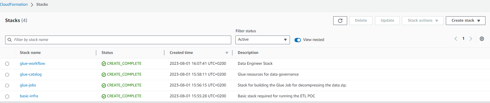

* **S3 buckets** used for storing data, query results and code artifacts required by the etl jobs:
    + `artifacts bucket`: for storing python and pyspark source code,
    + `raw stage data bucket`: for storing the data directly downloaded from the source,
    + `silver stage data bucket`: for storing the data after standardizing processing,
    + `gold stage data bucket`: for storing the data after standardizing and re-structuring,
    + `athena queries bucket`: for storing the results of queries run in Athena.

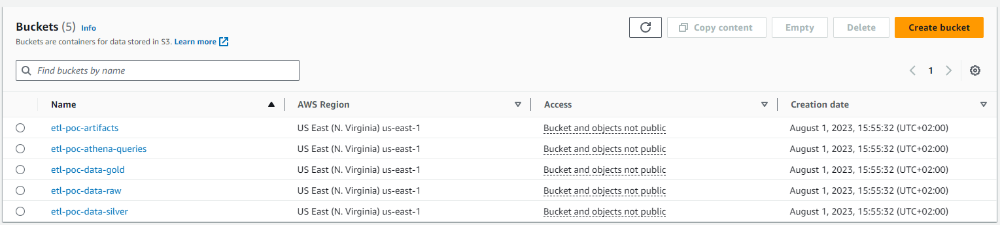

* **IAM roles** used to define access profiles for ETL jobs and crawlers:
    + `GluePythonJobRole`: execution role for python-based etl jobs,
    + `GlueSparkJobRole`: execution role for pyspark-based etl jobs,
    + `CrawlerRole`: execution for for data crawlers.

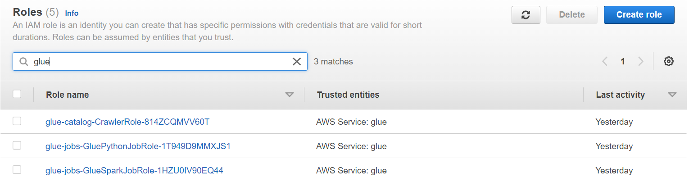

* **Glue jobs** for running extract-transform-load jobs:
    + `extract job`: downloading the data from the source and unzipping it, storing it in its original format
    + `cleaning job`: correcting data types, cleaning column names, droping duplicated records, storing data in parquet format
    + `repartition job`: repartitioning data by country and storing in parquet format

Job definitions:
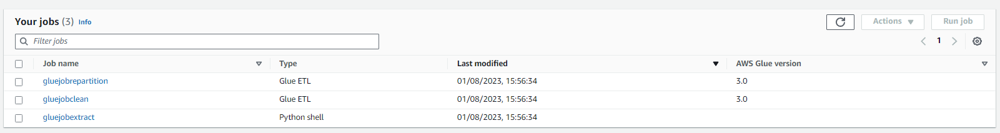

Artifact code used in the etl jobs:
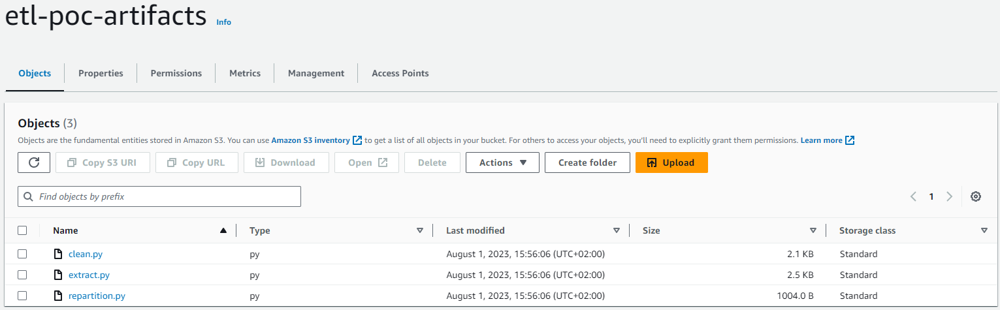

* **Glue Database** for storing the metadata of the tables generated by the ETL jobs. This metadata must be defined in order to make the data accessible in Athena for querying. Table metadata is automatically generated by the implemented crawlers, as described next.

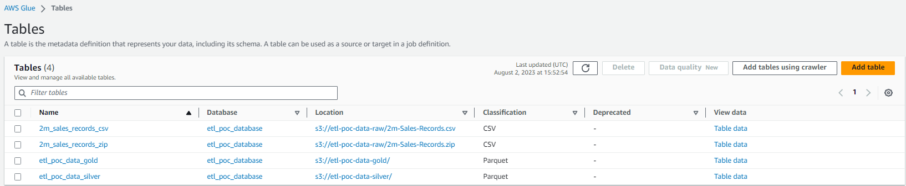

* **Glue Crawlers** for automatic generation of table metadata, required for making the extracted and transformed data available in Athena for querying:
    + `raw data crawler`: automatically creates a Glue Table definition for the data directly downloaded from the source (raw stage).
    + `silver stage crawler`: automatically creates a Glue Table definition for the data generated by the cleaning ETL job (silver stage).
    + `gold stage crawler`: automatically creates a Glue Table definition for the data generated by the repartitioning ETL job (gold stage).

Crawlers:
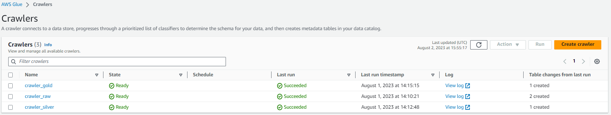

An example of metadata generated by the `gold stage crawler`:
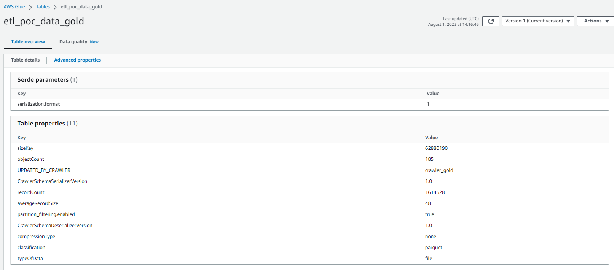
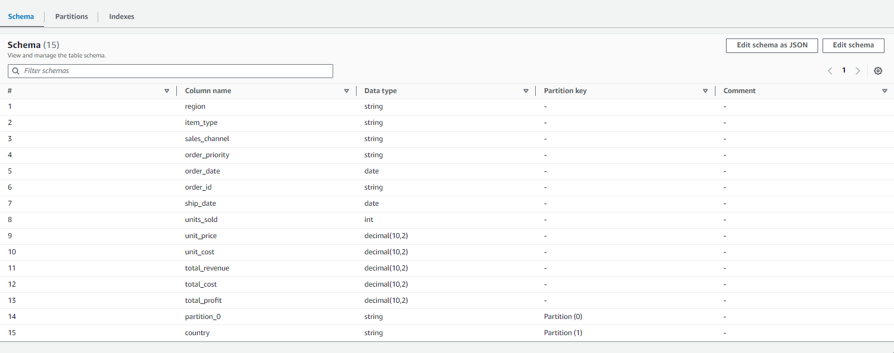

* **Athena work group**: defines the setup for querying the data in this project, namely, what S3 bucket is used for storing query results. Can also be used for limiting data usage, for cost control.

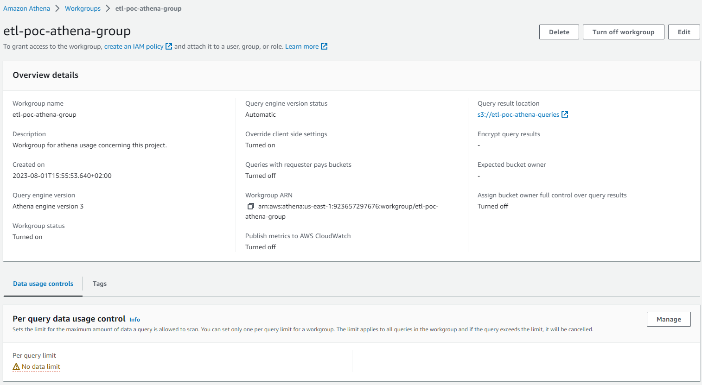

* **Glue Workflow** and **Triggers**: orchestrate between the Glue ETL jobs and the Glue Crawlers. In this project, triggers are based on user action (on-demand trigger) or events. The workflow logic is as follows (image below):
    + `on-demand workflow trigger`: starts the data extraction job,
    + `successful data extraction`: triggers the raw data crawler and the cleaning job,
    + `successful data cleaning`: triggers the silver data crawler and the repartition job,
    + `successful repartition`: triggers the gold data crawler.

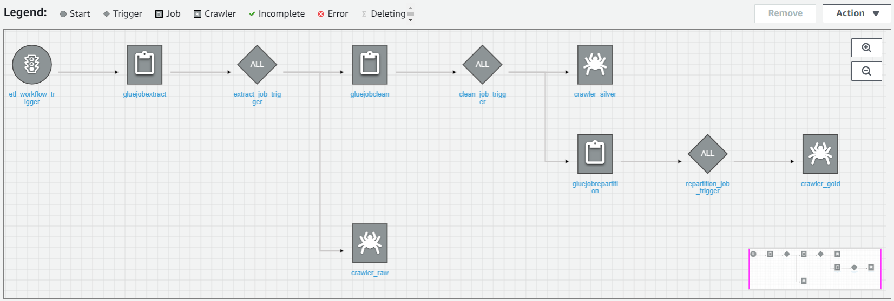


<a name="configure-project"></a>
# Configuring the project

<a name="project-requirements"></a>
## Project requirements

The data ingestion solution in this repo is based on a series of AWS resources. Folder `cloudformation/` contains the series of stacks defining those resources. These stacks can be built using the script [build.py](build.py) in the root of the repo (script adapted from [aws-samples/aws-etl-orchestrator](https://github.com/aws-samples/aws-etl-orchestrator)).

Running `build.py` for deploying these stack requires:

* python (version 3.9)
* AWS CLI configured with full access to the following:
    + Amazon S3
    + Amazon CloudWatch and CloudWatch Logs
    + AWS CloudFormation
    + Creating IAM Roles
* python libraries `pynt` and `boto3` (libraries used for facilitating the local management of cloudformation stacks)


<a name="deploy-resources"></a>
## Deploying the resources

Given how the resources for this project were organized into different stacks, in order to completely deploy them, the following commands must be executed in this specific order:

```
pynt createstack[basic-infra]
pynt deploygluescripts
pynt createstack[glue-jobs]
pynt createstack[glue-catalog]
pynt createstack[glue-workflow]
```

The stacks are defined by the `.yml` files under the `cloudformation/` folder. Each stack uses the parameters defined in the respective `.json` file, under the same folder.

<a name="run-workflow"></a>
## Running the ETL workflow

If all commands in the previous section run successfully, you can execute the full ETL workflow (Glue Jobs and Crawlers) directly from the "AWS Glue" console. On the left bar, click on "Workflows (orchestration)". Select the workflow named `etl_workflow` and click on "Run workflow". In alternative, run in a local terminal `aws glue start-workflow-run --name etl-workflow`.

<a name="check-schemas"></a>
## Checking schemas

Once the workflow has completely run, you can check the generated metadata also in the "AWS Glue" console under: `Data Catalog > Databases > Tables`.


<a name="run-queries"></a>
## Running queries on extracted data

Successful execution of the Glue Crawlers in the workflow automatically creates the metadata required to make the generated datasets available for querying in Athena. 

Queries can be edited and executed directly in the `Amazon Athena > Query editor` page in the AWS console, as long as the correct `Workgroup` is selected (i.e. the work group created by the `basic-infra` stack in this project). 

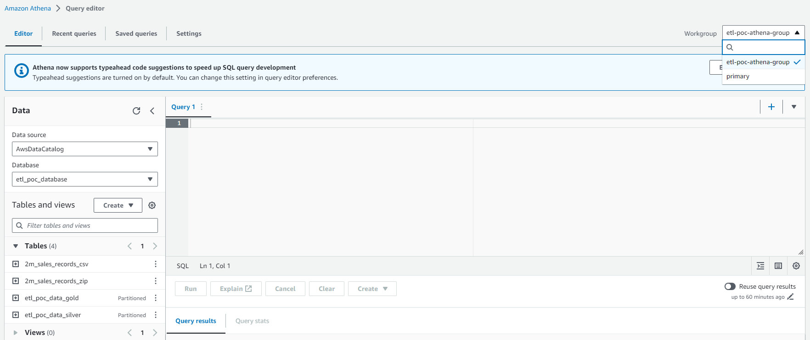

For example, querying the total profit per region, 
```
select region, cast(sum(total_profit)/1e9 as int) as profit_Billions
from "etl_poc_data_gold"
group by region
order by profit_Billions desc
```
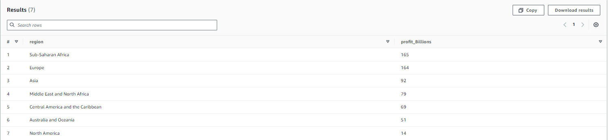

Or running a slightly more complex query for the top-3 countries per region in terms of profit:
```
select *
from (
    select *,
    row_number() over (partition by region order by profit_Millions desc) as n
    from
    (
      select region, 
      country,
      cast(sum(total_profit)/1e6 as int) as profit_Millions
      from "etl_poc_data_gold"
      group by region, country
    )
)
where n <= 3
order by region, profit_Millions desc
```
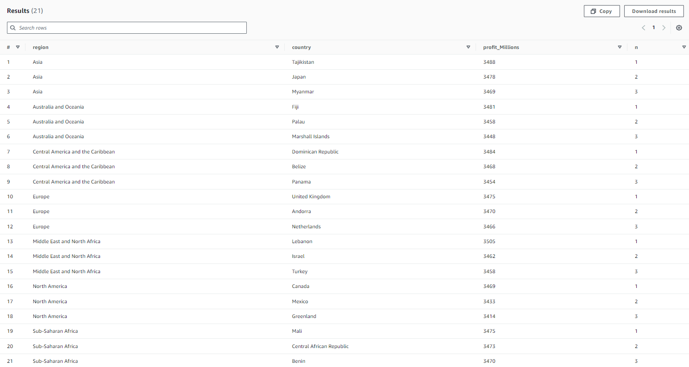

Athena also provides info on recent queries executed, run time, and data scanned, which can be useful for managing costs and adapting processes (e.g. setting data usage control limits in Athena).


<a name="delete-resources"></a>
## Deleting resources

In order to delete the cloudformation stacks, the following commands must be run in this specific order:

```
pynt deletestack[glue-workflow]
pynt deletestack[glue-catalog]
pynt deletestack[glue-jobs]
deleteS3bucket[etl-poc-artifacts]
deleteS3bucket[etl-poc-athena-queries]
deleteS3bucket[etl-poc-data-raw]
deleteS3bucket[etl-poc-data-silver]
deleteS3bucket[etl-poc-data-gold]
pynt deletestack[basic-infra]
```

Note that deleting the `basic-infra` stack requires that the objects in the respective buckets are delete beforehand.


<a name="architectural-decisions"></a>
# Notes on architectural decisions

The solution in this repo implements both the ETL jobs and metadata using the AWS Glue service, contrary to other architectures commonly found in the literature which use both Glue and Lambda functions. Some reasons for not using Lambda functions:

* Lambda functions and Glue jobs have very similar format (python scripts). However, Glue Job runtimes suport a broader set of libraries and provide seamless pyspark integration. The codebase is therefore simpler and thus easier to maintain.
* Eventual limitations of Glue jobs are easily overcome, e.g. triggering by specific services. 
* Longer execution time and higher cost of Glue Jobs is, at least for the current use case, negligible. Also, the project was developed under the assumption of one-time or sporadic execution of the ETL pipeline.

<a name="improvements"></a>
# Possible improvements

This project was developed with the goal of having a functional solution for an ingestion pipeline on a tight timeline. Several suboptimal architectural decisions were therefore taken to allow fast development. 

Possible improvements are:

* Automating the project lifetime management with CI/CD processes
* Re-organizing cloudformation stacks
* Considering Terraform in alternative to Cloudformation for infrastructure management 
* Refining IAM role access policies
* Adding data quality checks
* Improve the ETL processing (e.g. country names)
* Defining data access profiles (e.g. granting access to users only to data in the "gold" stage)
* Setting data usage control limits in Athena
* Setting up alarms for job execution failure


<a name="costs"></a>
# Some notes on costs

## S3 buckets

AWS S3 charges not only for the storage itself, but also for the actions on that storage ("get", "create", "update", etc.). Therefore, executing Glue Jobs, Glue Crawlers and Athena queries also generates costs in S3.

## Athena

AWS Athena charges either per query (the default) or per provisioned capacity. 

* Per query, we are charged per MB scanned with a minimum of 10 MB per query. 
* Per provisioned capacity, we are charged per compute capacity and time, with a minimum of 8 hours. 

Given the above, the charging per provisioned capacity will make more sense if there is a daily, continuous use of Athena for querying data.

In both cases, and just like for S3, using adequate data partitioning can greatly reduce costs.

Running queries in Athena also generates costs in S3 and Glue.


## Glue

Among all services used in this project, and given how these have been used, Glue is by far the most expensive. 

**Glue jobs** 

Billed per DPU-Hour (DPU - data processing units). Both Python Shell jobs and Pyspark jobs are charged $0.44 per DPU-Hour with a minimum of 1 minute. 

For Python Shell jobs, the minimum allocation is 0.0625 DPU, and this is also the default value.

For Pyspark jobs, the minimum allocation is 2 DPU but the default is 10, so it's important to setup this value correctly.

In this project, the 2 pyspark jobs (clean and repartition) usually run below 2 minutes using 2 DPU. This would make around $0.03 per execution ($0.06 for both).

The extract job usually run below 30 seconds, but given that the minimum billing is 1 minute, each execution costs $0.0005 (because it only uses 0.0625 DPU). 

If using Lambda functions instead, then costs would be charged by GB-second and number of requests (and returned payload, if applicable). For an x86 architecture, the price is $0.0000166667 for every GB-second and $0.20 per 1M requests. In this case, our dataset is only 238.0 MB (csv format, after unzipping), so the extract job would cost $0.0001 (considering 30 seconds of execution, assuming it would be the same as for the Glue job). This is 5x lower than the cost on the extract job in Glue, even though both costs are quite low. 

Glue jobs were used in this project for their simplicity and given the assumptions considered. Nevertheless, in a real-world scenario, with a larger number and larger size of datasets and frequent workflow executio, it could make sense to consider implementing some or all of these steps in Lambda functions, at the expense of a larger codebase to maintain.

**Glue Crawlers**

Glue Crawlers have a billing similar to that of etl jobs: $0.44 per DPU-Hour. However, in this case, the minimum billed is 10 minutes per execution. Therefore, costs can build up quicker than for normal etl jobs.

Glue Crawlers are not strictly required for having access to data in Athena. The metadata for tables can as well be added to the data catalog with explicit schema definition. 

Otherwise, it can make sense to assume that the schema of data source will not change frequenty. Therefore, even if they are used, crawlers don't necessarily need to run with the same frequency as the ETL jobs. 

**Glue Catalog**

In Glue Catalog, billing is done in terms of objects (tables, table versions, partitions, partition indexes, or databases) and access requests.

The costs are:
* $1.00 per 100,000 objects stored above 1M, per month
* $1.00 per million requests above 1M in a month
* free tier including 1st million objects and requests

These costs are usually negligigle compared to jobs and crawlers.